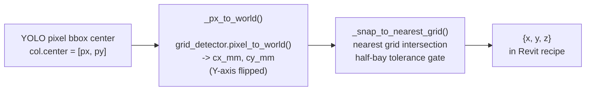
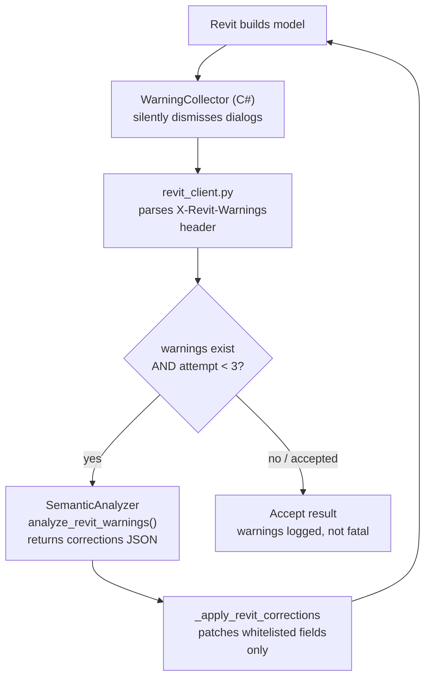

# MCC Amplify v4 — Floor Plan to BIM

AI-powered system that converts PDF floor plans into native Revit (`.RVT`) BIM models and interactive 3D web previews (glTF/GLB).

---

## What the System Does

Upload a PDF architectural floor plan and receive a fully-formed, editable Revit file. No manual re-drawing, no IFC round-trips. The system:

1. Extracts precise vector geometry and text directly from the PDF.
2. Renders the page as a high-resolution image and runs a YOLOv11 detector to identify walls, doors, windows, columns, and rooms.
3. Fuses vector precision with ML detection results — wall endpoints are snapped to the nearest axis-aligned vector line.
4. Detects the structural column grid from vector geometry and its dimension annotations to derive the real-world coordinate scale. Scale text printed on the drawing (e.g. "1:100") is intentionally ignored as unreliable.
5. Runs an **intelligence middleware layer** — type resolution (circular/rectangular classification via contour analysis), cross-element validation (IoU overlap, grid distance, isolation checks), and DfMA rule enforcement (SS CP 65).
6. Sends the rendered image and fused elements to a vision-capable AI model (Google Gemini or Anthropic Claude) for semantic enrichment — building type, materials, room purposes, etc.
7. Generates Semantic 3D parameters (wall locations, door swings, window sill heights, slab boundaries) formatted as Revit API instructions.
8. Enriches the Revit recipe with intelligence metadata (resolved types, validation flags, DfMA compliance status).
9. Sends the instructions over the network to a Windows machine running Revit, where a C# Add-in creates all elements natively via the Revit API, and returns the resulting `.RVT` file.
10. Simultaneously exports a lightweight `.glb` (glTF binary) for instant web-based 3D preview, including walls, columns, doors, windows, and floor slabs.

---

## Architecture

```
Ubuntu (Linux) Machine                    Windows Machine
+--------------------------------------+  +----------------------------------+
|  FastAPI Backend (port 8000)         |  |  Revit 2023                      |
|  +--------------------------------+  |  |  +----------------------------+  |
|  |  PDF Security Check            |  |  |  |  C# Add-in (RevitAddin)    |  |
|  |  Track A: Vector Extraction    |  |  |  |  TcpListener on TCP :5000  |  |
|  |  Track B: Raster Render+YOLO   |  |  |  |  Receives JSON transaction  |  |
|  |  Hybrid Fusion (vector snap)   |  |  |  |  Builds walls/doors/columns |  |
|  |  Grid-based Scale Detection    |  |  |  |  Returns .RVT file         |  |
|  |  Intelligence Middleware       |--+--+->|                            |  |
|  |  Semantic AI (Gemini/Claude)   |  |  |  +----------------------------+  |
|  |  3D Geometry Generation        |  |  |                                  |
|  |  BIM Translator Enrichment     |  |  +----------------------------------+
|  |  RVT Exporter (RevitClient)    |<-+--+
|  |  glTF Exporter                 |  |
|  +--------------------------------+  |
|  Chat Agent (NVIDIA NIM / Gemini)    |
|  React + Three.js Frontend (5173)    |
+--------------------------------------+
```

Both machines must be on the same local network (or VPN). The Ubuntu machine is the primary — it hosts the web UI, runs all AI processing, and drives the Windows Revit machine.

---

## Pipeline Stages

```mermaid
flowchart TD
    PDF(["PDF Upload"])

    PDF --> SEC

    subgraph SEC["Stage 1 - Security & Size Check"]
        sec["SecurePDFRenderer
        Validate magic bytes, cap render DPI"]
    end

    SEC --> VEC & RAS

    subgraph PAR["Stage 2 - Parallel Tracks"]
        VEC["Track A - Vector Extraction
        VectorProcessor
        PyMuPDF paths + text spans
        Multi-page column schedule scan"]
        RAS["Track B - Raster Render + YOLO
        StreamingProcessor -> column-detect.pt
        Tiling inference (1280px tiles, 200px overlap)
        NMS + squareness filter"]
    end

    VEC & RAS --> FUS

    subgraph FUSBOX["Stage 3 - Hybrid Fusion"]
        FUS["HybridFusionPipeline
        Snap YOLO detections to vector lines
        Refine wall endpoints"]
    end

    FUS --> GRD

    subgraph GRDBOX["Stage 4 - Grid Detection"]
        GRD["GridDetector
        Structural grid from PDF vector geometry
        Dimension annotations -> mm spacings
        Align pixel reference to YOLO column centres"]
    end

    GRD --> INT

    subgraph INTBOX["Stage 4c - Intelligence Middleware"]
        INT["TypeResolver
        Contour analysis: circular / rectangular / L-shape"]
        INT --> CEV["CrossElementValidator
        IoU overlap, grid distance, isolation checks"]
        CEV --> VAL["ValidationAgent
        DfMA rules (SS CP 65)
        Orphan detection"]
    end

    VAL --> SEM

    subgraph SEMBOX["Stage 5 - Semantic AI"]
        SEM["SemanticAnalyzer
        Column annotation parsing from PDF text"]
        SEM -->|priority 1| OLL["Ollama
        gemma3:4b / qwen3-vl"]
        SEM -->|priority 2| GEM["Google Gemini API"]
        SEM -->|priority 3| ANT["Anthropic Claude API"]
    end

    OLL & GEM & ANT --> GEO

    subgraph GEOBOX["Stage 6 - 3D Geometry Generation"]
        GEO["GeometryGenerator
        _px_to_world: pixel -> real-world mm
        _snap_to_nearest_grid: half-bay tolerance
        Build Revit API recipe JSON"]
    end

    GEO --> BTE

    subgraph BTEBOX["Stage 6.5 - BIM Translator Enrichment"]
        BTE["BIMTranslatorEnricher
        Append intelligence metadata to recipe
        resolved_type, validation_flags, DfMA status"]
    end

    BTE --> RVTBOX & GLTBOX

    subgraph RVTBOX["Stage 7a - RVT Export (Linux to Windows)"]
        EXP["RvtExporter + RevitClient
        HTTP POST to Revit 2023 C# Add-in
        Builds levels, grids, walls
        columns, doors, windows, slabs"]
        EXP --> WRN{"Revit warnings?"}
        WRN -->|"yes, attempt <= 2"| FIX["AI correction round
        SemanticAnalyzer patches recipe"]
        FIX -->|resend| EXP
        WRN -->|"no / accepted"| RVT[".rvt file"]
    end

    subgraph GLTBOX["Stage 7b - glTF Export"]
        GLTF["GltfExporter
        .glb with Z-up to Y-up rotation
        walls, columns, floors, openings"]
    end

    RVT & GLTF --> DONE(["BIM model + 3D preview ready"])
```



### Stage Summary

| # | Stage | Component | Notes |
|---|-------|-----------|-------|
| 1 | Security & size check | `SecurePDFRenderer` | Caps render DPI to prevent resource exhaustion |
| 2a | Vector extraction | `VectorProcessor` | Extracts paths + text spans from the PDF (PyMuPDF) |
| 2b | Raster render + detection | `StreamingProcessor` + YOLO | Tiling inference with `column-detect.pt`, NMS + squareness filter |
| 3 | Hybrid fusion | `HybridFusionPipeline` | Snaps YOLO wall endpoints to nearest vector line |
| 4 | Grid detection | `GridDetector` | Derives real-world scale from structural grid lines + dimension annotations; scale text ignored |
| 4c | Intelligence middleware | `resolve_types` / `validate_elements` / `enforce_rules` | Type classification, IoU/grid/isolation validation, DfMA rule enforcement |
| 5 | Semantic AI analysis | `SemanticAnalyzer` | Ollama (gemma3:4b) -> Gemini -> Claude; enriches elements with material, type, room purpose. Column annotation parsing from PDF text |
| 6 | 3D geometry | `GeometryGenerator` | Converts 2D elements to Revit API parameters (grid-based mm coords, Y-axis inverted for Revit) |
| 6.5 | BIM enrichment | `BIMTranslatorEnricher` | Appends intelligence metadata to Revit recipe columns |
| 7 | BIM export | `RvtExporter` + `GltfExporter` | Sends to Windows Revit with closed-loop warning correction; also writes `.glb` |

---

## Column Placement Pipeline (Protected Subsystem)

The exact flow below is frozen and must be preserved bit-for-bit:



No middleware, validator, or enricher may alter `cx_mm`, `cy_mm`, or `{x, y, z}` values after `_snap_to_nearest_grid()` runs.

---

## Project Structure

```
mcc-amplify-v4/
|-- run.sh                              <- Start Ubuntu backend + frontend
|-- scripts/
|   |-- setup.sh / setup.bat            <- One-time venv + pip install for the backend (Linux / Windows)
|   |-- run.sh                          <- Canonical Ubuntu launcher (root run.sh just forwards here)
|   |-- run.bat                         <- Windows-side: launch Revit 2023 and wait for the add-in on :5000
|   |-- retrain_yolo.py                 <- YOLO fine-tuning flywheel driven by CorrectionsLogger output
|   └-- scan_family_library.py          <- Regenerate data/family_library/index.json
|
|-- backend/
|   |-- app.py                          <- FastAPI entry point
|   |-- .env                            <- Configuration (not committed)
|   |-- api/
|   |   |-- routes.py                   <- REST endpoints (upload, process, download)
|   |   └-- websocket.py               <- Real-time progress updates
|   |-- pipeline/
|   |   └-- pipeline.py                <- Thin wrapper around PipelineOrchestrator
|   |-- agents/
|   |   └-- revit_agent.py             <- Claude MCP agent for step-by-step Revit placement
|   |-- chat_agent/
|   |   |-- agent.py                   <- Chat agent (NVIDIA NIM DeepSeek / Gemini)
|   |   |-- context_manager.py         <- Per-user conversation context
|   |   |-- message_router.py          <- Routes messages to correct handler
|   |   └-- pipeline_observer.py       <- Bridges pipeline events to chat
|   |-- mcp/
|   |   |-- server.py                  <- MCP server for Revit agent
|   |   └-- tools.py                   <- MCP tool definitions
|   |-- services/
|   |   |-- core/orchestrator.py       <- Main pipeline orchestrator (all stages)
|   |   |-- pdf_processing/            <- VectorProcessor, StreamingProcessor
|   |   |-- security/                  <- SecurePDFRenderer, ResourceMonitor
|   |   |-- fusion/pipeline.py         <- HybridFusionPipeline (vector snapping)
|   |   |-- grid_detector.py           <- Structural grid detection, pixel->mm conversion
|   |   |-- yolo_runner.py             <- Tiling inference: CLAHE + 1280 px tiles / 200 px overlap + NMS
|   |   |-- column_annotator.py        <- 5-pass column annotation parser (schedule, proximity, vision LLM, single-scheme, 800 mm default)
|   |   |-- semantic_analyzer.py       <- Multi-backend AI (Ollama / Gemini / Claude)
|   |   |-- geometry_generator.py      <- 2D -> Revit 3D parameter builder
|   |   |-- revit_client.py            <- HTTP client -> Windows Revit Add-in
|   |   |-- job_store.py               <- SQLite-backed persistent job status (LRU eviction)
|   |   |-- intelligence/              <- Post-detection middleware layer
|   |   |   |-- type_resolver.py       <- Circular/rectangular/L-shape classification
|   |   |   |-- cross_element_validator.py <- IoU, grid distance, isolation checks
|   |   |   |-- validation_agent.py    <- DfMA rule enforcement (SS CP 65)
|   |   |   └-- bim_translator_enricher.py <- Append metadata to Revit recipe
|   |   |-- exporters/
|   |   |   |-- rvt_exporter.py        <- Sends to Windows, receives .RVT
|   |   |   └-- gltf_exporter.py       <- Writes .glb (Z-up to Y-up rotation)
|   |   |-- corrections_logger.py      <- Logs human corrections for YOLO retraining
|   |   └-- vision_comparator.py       <- Vision-based diff for Revit feedback
|   |-- ml/weights/                     <- (user-supplied) place column-detect.pt here; see Troubleshooting
|   └-- utils/
|       |-- api_keys.py                <- Key resolution (env var -> .txt file)
|       |-- file_handler.py            <- Upload file handling
|       └-- logger.py                  <- Loguru setup
|
|-- revit_server/
|   └-- RevitAddin/                    <- C# Revit 2023 Add-in (build on Windows)
|       |-- App.cs                     <- TcpListener :5000 + ExternalEvent handler
|       |-- ModelBuilder.cs            <- Creates levels, grids, walls, columns, etc.
|       |-- RevitModelBuilder.addin    <- Revit add-in manifest
|       └-- RevitAddin.csproj
|
|-- frontend/                          <- React + Three.js web UI
|   └-- src/
|       └-- components/
|           |-- Layout.jsx             <- Root layout; wires upload/viewer/chat/edit + human-in-the-loop state
|           |-- UploadPanel.jsx        <- PDF upload + processing trigger (includes real-time progress bar)
|           |-- Viewer.jsx             <- 3D glTF viewer (Three.js)
|           |-- ChatPanel.jsx          <- AI chat assistant
|           └-- EditPanel.jsx          <- Element editing panel
|
|-- data/                              <- Runtime data (created automatically)
|   |-- uploads/
|   |-- models/
|   |   |-- rvt/                       <- Returned .RVT files
|   |   └-- gltf/                      <- Exported .glb files
|   |-- family_library/                <- Revit family sidecar JSON files
|   |   └-- index.json                 <- Generated by scripts/scan_family_library.py
|   └-- revit_families.json            <- Family type definitions
|
└-- tests/
    |-- test_column_annotator.py       <- Column annotation parser (synthetic data, no YOLO/AI needed)
    |-- test_fusion_pipeline.py        <- HybridFusionPipeline coordinate transforms + wall snapping
    |-- test_intelligence_middleware.py <- Intelligence layer (type resolver, validator, DfMA rules)
    └-- test_job_store.py              <- SQLite job store
```

---

## Configuration

Key settings in `backend/.env`:

```bash
# -- Chat Agent ----------------------------------------------------------------
# NVIDIA NIM is default (free 1000 credits) -- put key in backend/nvidia_key.txt
# Sign up: https://build.nvidia.com
CHAT_MODEL_BACKEND=nvidia_nim           # or: gemini_api

# -- Semantic AI Backend (pipeline Stage 5) ------------------------------------
SEMANTIC_MODEL_BACKEND=gemini_api       # or: anthropic_api, ollama
# Put API keys in backend/google_key.txt or backend/nvidia_key.txt (gitignored)
# Env vars also accepted: GOOGLE_API_KEY, ANTHROPIC_API_KEY, NVIDIA_API_KEY

# -- Windows Revit Server ------------------------------------------------------
WINDOWS_REVIT_SERVER=http://LT-HQ-277:5000
REVIT_SERVER_API_KEY=choose_a_shared_secret

# -- Intelligence Middleware ---------------------------------------------------
COLUMN_CONF_THRESHOLD=0.25      # YOLO confidence for column detection
MAX_GRID_DIST_PX=80             # Max px distance from grid before "off_grid" flag
ISOLATION_RADIUS_PX=200         # Neighbourhood consensus radius
MIN_BAY_MM=3000                 # DfMA minimum bay spacing (SS CP 65)
MAX_BAY_MM=12000                # DfMA maximum bay spacing (SS CP 65)

# -- FastAPI -------------------------------------------------------------------
APP_HOST=0.0.0.0
APP_PORT=8000

# -- Upload Limits -------------------------------------------------------------
MAX_UPLOAD_SIZE=52428800   # 50 MB
ALLOWED_EXTENSIONS=pdf
```

### Architectural defaults (geometry_generator)

| Parameter | Default | Unit |
|-----------|---------|------|
| Wall height | 2800 | mm |
| Wall thickness | 200 | mm |
| Door height | 2100 | mm |
| Window height | 1500 | mm |
| Sill height | 900 | mm |
| Floor thickness | 200 | mm |
| Column default size | 800 | mm |

---

## Quick Start

### Step 1 -- Prepare Windows (run once per session)

On the **Windows machine**, open PowerShell as Administrator and run:

```powershell
cd C:\path\to\mcc-amplify-v4\revit_server\RevitAddin
dotnet clean && dotnet build
Copy-Item RevitModelBuilder.addin, bin\Debug\net48\RevitModelBuilderAddin.dll `
    -Destination "C:\ProgramData\Autodesk\Revit\Addins\2023\"
Start-Process "C:\Program Files\Autodesk\Revit 2023\Revit.exe"
```

**When Revit opens:**
- Click **"Always Load"** on the security dialog to allow the Add-in.
- Open or create a project file -- the Add-in requires an active document.

Once Revit has fully loaded, verify the service is reachable from Ubuntu:

```bash
curl http://LT-HQ-277:5000/health
# Expected: Revit Model Builder ready
```

### Step 2 -- Configure network on Ubuntu (first-time only)

```bash
echo "191.168.124.64 LT-HQ-277" | sudo tee -a /etc/hosts
# Replace with your actual Windows IP (ipconfig on Windows) and hostname
```

### Step 3 -- Start the Ubuntu system

```bash
# From the project root
./run.sh
```

This starts:
- **Backend** at `http://localhost:8000`
- **Frontend** at `http://localhost:5173`

The script waits for the backend to be ready before starting the frontend. Press `Ctrl+C` to stop both.

### Step 4 -- Upload and process

1. Open `http://localhost:5173` in a browser.
2. Upload a **PDF** floor plan (max 50 MB).
3. Watch the real-time progress bar advance through all pipeline stages.
4. When processing completes:
   - Download the native **`.RVT`** file and open it in Revit -- all walls, doors, windows, and columns will be editable native elements.
   - View the **3D web preview** (glTF) directly in the browser.

---

## System Requirements

### Ubuntu Machine
- Ubuntu 20.04 LTS or newer
- Python 3.10+
- Node.js 18+
- 16 GB RAM minimum (32 GB recommended for large PDFs)
- `tesseract-ocr`, `poppler-utils` installed

### Windows Machine
- Windows 10/11 Pro or Windows Server 2019+
- Revit 2023 (with valid license)
- .NET SDK 8.0 (for building) + .NET Framework 4.8 (for running)

---

## Closed-Loop Revit Feedback System



Key behaviours:
- **No popup dialogs** -- `IFailuresPreprocessor.PreprocessFailures()` calls `fa.DeleteWarning(msg)` on every warning, so Revit never shows the dialog.
- **Fatal errors** still cause transaction rollback and return a 500 from the C# server.
- **Max 2 correction rounds** -- prevents infinite loops; after round 2, whatever Revit built is accepted.
- **Safety guardrails** -- `_apply_revit_corrections()` only patches whitelisted numeric fields (width, depth, height, thickness, etc.) so the AI cannot corrupt structural keys like level or id.

---

## Troubleshooting

**`curl http://LT-HQ-277:5000/health` times out**
- Verify the Windows IP in `/etc/hosts` is correct.
- Check that Windows Firewall allows inbound TCP on port 5000:
  ```powershell
  netsh advfirewall firewall add rule name="RevitAddin5000" dir=in action=allow protocol=TCP localport=5000 profile=any
  ```
- Ensure Revit is not in a modal state (Options dialog, Print dialog) -- these block the Revit API.

**Grid detection falls back to uniform grid**
- The system derives scale from structural column grid lines and dimension annotations in the PDF vector layer.
- If no grid is detected, a uniform 5x4 grid at 6000 mm bays is used as a fallback.
- Check the backend log: grid source and line count are logged at Stage 4.

**YOLO weights not found**
- Place the trained weights at `backend/ml/weights/column-detect.pt`.
- The pipeline continues without YOLO; only vector geometry is used downstream.

**Backend won't start**
```bash
which python && python -c "import fastapi, loguru; print('OK')"
tail -50 logs/app.log
```

**RVT file empty / Revit error**
- Check `C:\RevitOutput\addin_startup.log` and `C:\RevitOutput\build_log.txt` on Windows.
- Confirm the Add-in loaded: check the Add-ins tab in the Revit ribbon.
- Run Revit as Administrator if permission errors appear.

---

## Performance Expectations

| Metric | Value |
|--------|-------|
| Processing time | 30-90 s per floor plan |
| Wall detection accuracy | 85-95 % |
| Door / window detection | 80-90 % |
| Column detection | 75-90 % |
| Max file size | 50 MB |

---

## Support

- GitHub Issues: <https://github.com/josephteh97/mcc-amplify-ai/issues>
- API docs (when backend is running): <http://localhost:8000/api/docs>
